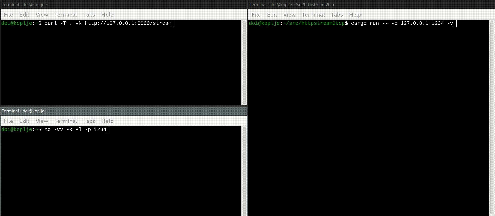

# HTTPSteam2TCP - An HTTP to TCP streaming utility

HTTPStream2TCP is a server that allows using HTTP chunked transfer encoding to stream data to a TCP socket. This effectively allows utilities that support asynchronous HTTP transfers, such as `curl`, to read and write data to any network port. This is proof-of-concept code at this time and is not recommended for production usage. No transport layer encryption is offered.

By default, this utility will forward any data sent to `<server>:3000/stream` via PUT to `127.0.0.1:22`. A simple way to write to this service is via `curl -T . -N http://127.0.0.1:3000/stream'.

This utility is built using the Rust Hyper HTTP library, and currently supports HTTP/1.1. 

## Example Usage - Simple Network Port Forward

Run HTTPStream2TCP with `cargo run -- -v -c 127.0.0.1:1234` to forward data from the stream to TCP port 1234 on localhost:



## Example Usage - SSH

By default, HTTPStream2TCP will listen on port 3000 on any address for incoming HTTP requests, and forward data to `127.0.0.1:22`. Using `-v` will show the packet data as it's traversing the service. The following command can be used with HTTPStream2TCP to get to ssh:

```
ssh -v -o ProxyCommand="curl -s -N 127.0.0.1:3000/stream -T . --no-progress-meter --expect100-timeout 0.01" 127.0.0.1
```


The Hyper library does not respond with a `100 Continue`, so the `--expect100-timeout` flag speeds things up a bit. Note, running HTTPStream2TCP with `-v` will impact performance as all packets end up getting logged to `stdout` server side. 

The following shows an 8GB file being SCP-ed via HTTPStream2TCP. The file is being copied to SSH on localhost here to demonstrate the performance impact when not in verbose mode:

```
doi@koplje:~/tmp$ ls -lh test.dat 
-rw-r--r--. 1 doi doi 8.0G Jun  2 20:17 test.dat
doi@koplje:~/tmp$ scp test.dat 127.0.0.1:weh
test.dat                                   100% 8192MB 737.3MB/s   00:11    
doi@koplje:~/tmp$ scp -o ProxyCommand="curl -s -N 127.0.0.1:3000/stream -T . --no-progress-meter --expect100-timeout 0.01" test.dat 127.0.0.1:weh
test.dat                                   100% 8192MB 548.9MB/s   00:14    
doi@koplje:~/tmp$ 
```

## Usage

```
Usage: httpstream2tcp [OPTIONS]

Options:
  -a, --address <ADDRESS>                Address to bind the server to. [default: 0.0.0.0]
  -p, --port <PORT>                      Port to listen on. [default: 3000]
  -c, --client-address <CLIENT_ADDRESS>  IP to connect to. [default: 127.0.0.1:22]
  -v, --verbose                          Verbose mode.
  -h, --help                             Print help
  -V, --version                          Print version
``` 

## Building

Clone this repository and build with `cargo build`.
